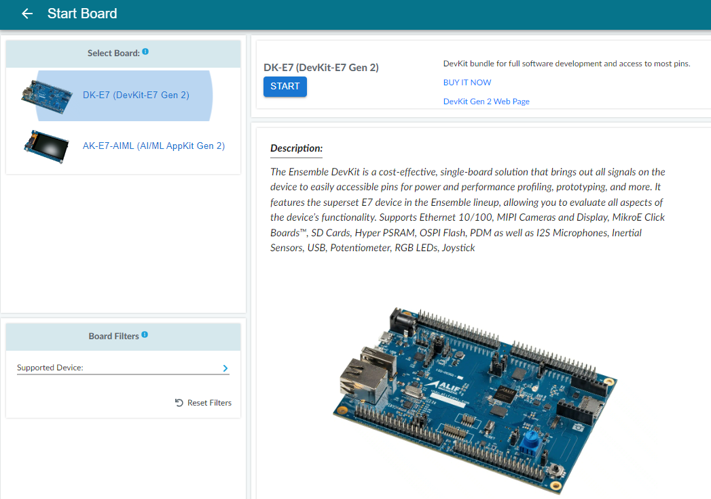
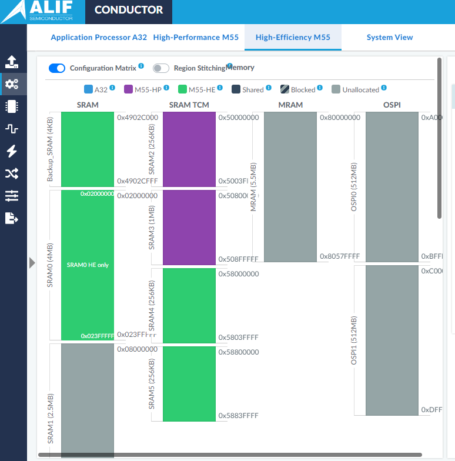
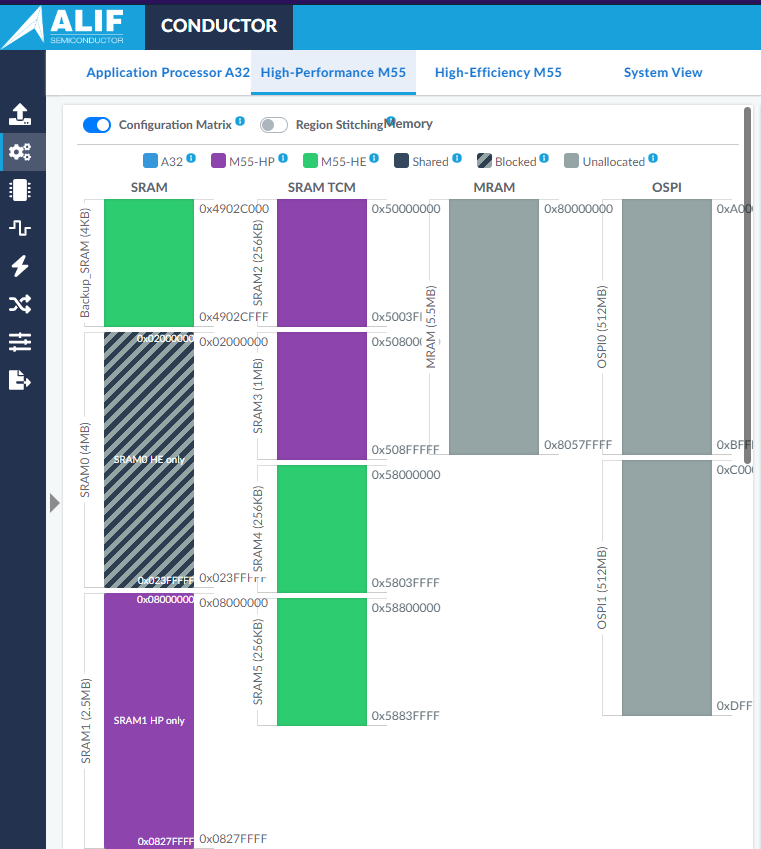
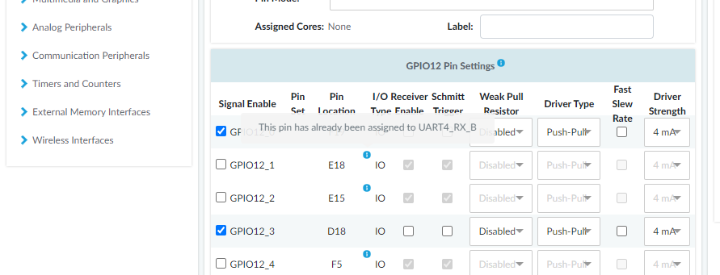
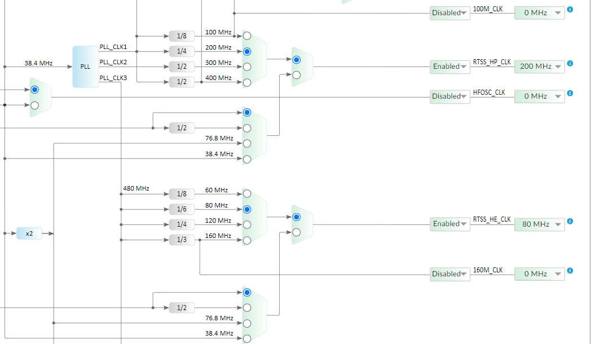

# Conductor Device Configuration Tool

## Introduction

The purpose of the Alif Conductor device configuration tool is to help customers with the configurations
of device resources, pins, clocks, memories, DMA, IRQs, and various other additional settings. The
Conductor tool can also be useful for giving power estimates and trying with different choices how they
affect to power consumption.

The purpose of this document is to introduce the user to the Conductor tool by showing how to create a
configuration for a Conductor tool demo application.

Alif Conductor tool can be found from https://conductor.alifsemi.com/


## Required tools and prequisites

Read “Ensemble DevKit User Guide” (https://alifsemi.com/support/kits/ensemble-devkit-gen2/) and
“Alif Security Toolkit User Guide” (https://alifsemi.com/support/software-tools/ensemble/ ) to get
understanding about the devkit and toolkit flow.
The “E7 Datasheet” (https://alifsemi.com/support/kits/ensemble-devkit-gen2/) is a good reference to
have when reading the Pins chapter.
The "E7 Hardware Reference Manual" (https://alifsemi.com/support/kits/ensemble-devkit-gen2/) is good to have around all the time, especially when checking clocks.

Tools:

1. The Alif Security Toolkit (SETOOLS). It contains several tools required to program and provision
    an Alif Semiconductor SoC device. Help for installing is available in document “Alif Security
    Toolkit User Guide” mentioned above.
2. Arm GNU Toolchain from https://developer.arm.com/downloads/-/arm-gnu-toolchain-downloads. For Linux, select the archive for x86_64 Linux hosted cross toolchains: AArch
    bare-metal target category. Using the latest stable version is always recommended. For
    Windows, select from Windows -> AArch32 bare-metal target category.
3. CMake, download and install from https://cmake.org/download/
4. Git, download and install from https://git-scm.com/download
5. Your favorite IDE or text editor. User guides for doing bare metal design with Keil MDK and VS
    Code/GCC are available on the User Guides page of the Alif website at
    https://alifsemi.com/support/application-notes-user-guides/ensemble/

## Step-by-step guide to create a Conductor Demo Application configuration for Ensemble E7

Open https://conductor.alifsemi.com/

### Help Manual

You should open the “Help Manual” from the menu on the right top corner. It opens to a new tab so
there is no chance of losing your work on Conductor tool. The Help Manual contains more detailed
information on how to configure and use the tool. There are also some helpful videos.

### Start Project

The Conductor tool does not automatically save your project so be careful, do not close your browser
when the project is still at work, and save your project from time to time. See [Save & Generate](#save--generate)
chapter how to save project.

Choose “Start Board” which starts a new project with the existing board. You could also choose “Start
Device” where it would be possible to create a custom board. This document aims to create
configurations for the existing Alif Ensemble E7 DevKit Gen 2 board for a Conductor Demo application.




From the upper left column, choose “DK-E7 (DevKit-E7 Gen 2)” under “Select Board”. E7 has two Cortex-A32 cores, two Cortex-M55 cores and two Ethos-U55 Neural Processing Units. Press the blue “START”
button found on top. This will take to the “Resources” tab.

### Resources

This is the place where we can set the memory regions to be used for processors. Memory regions can
be limited to one processor or shared memory between different processors. Peripheral access rights
and allocation to processors are also chosen here.



The Conductor tool demo application uses two M55 processors. To demonstrate how memory regions
can be accessed by only one processor, choose High-Efficiency M55 from the top. Press the
“Configuration Matrix” slider to enable memory modifications and firewall. Now you can also see the
default regions and memory access rights. Click the right mouse button over the SRAM0 memory and
choose “Add Region”. Give the region name of your choosing, for example “SRAM0 HE only”. Click “Advanced”, here you can choose size of the memory region, access rights and processors for this
memory region. Leave settings as is and click “OK” to finish adding memory region. Now you can see SRAM0 is colored green, and it is accessible only to the HE (High-Efficiency) core.

Next, assign SRAM1 for the HP (High-Performance) core. Choose “High-Performance M55” from the top.
Now you can see that SRAM0 is color black/grey, meaning that it is blocked from the HP core. Click the
right button on top of SRAM1 and add region the same way as it was done for SRAM0. Now the M55_HE
core is the only core that can access SRAM0, and the M55_HP core is the only core that can access
SRAM1.



### Available Peripherals
This is the place where you can assign peripherals to processors and set their access rights. For this example, there is no need to do this.

### Pins

Pins are already set correctly for E7-Devkit but let’s check how pins are set for UART2 and UART4 which
are used in the Conductor tool demo application. Select Pins from the left column. Pinout should be
selected already from the top, if it is not, select it. GPIO pins need to be set for UART usage. Table 4-2 in
“E7 Datasheet” chapter 4.3 shows the pin multiplexing table where you can see the GPIO multiplexing
possibilities. UART4 uses GPIO 12 with pins 1 and 2. This can be seen if you choose GPIO under GPIOs.
From middle column, choose GPIO12 under “Modules with Enabled Pins”. Now GPIO12_1 and
GPIO12_2 have blue info icon as they are preset because we started with the E7-Devkit board. Hovering
the mouse over the blue icon you can see that pins are already assigned to UART4. Same can be seen
with UART2, GPIO1_0 and GPIO1_1. If you select “Pin List” from the top, you can see all enabled GPIO pins, which
function is assigned to it, function dropdown-list and more configurations.



### Clocks

This view shows the clock tree and how changing the multiplexers and dividers affects the clocks. The
Hardware Reference Manual “Alif_E7_HWRM” shows the same clock tree with registers affecting the
multiplexers. RTTS_HP_CLK and RTTS_HE_CLK are the clocks going to HP and HE cores. We will change
those two clocks to demonstrate how the Conductor tool can be used to change clocks and so for
example save more power. Choose 200Mhz to RTTS_HP_CLK and 80Mhz to RTTS_HE_CLK from the drop-
down menus for those clock outputs on the right side. You can see how the previous mux selections
change the input to PLL and choose the correct clock from the PLL.




### DMA

The DMA tab allows the user to quickly route the different DMA requests to the desired DMA controller.
Conductor tool demo application does not require any DMA changes. See more from Conductor Tool Help Manual.

### Miscellaneous

In this page there are miscellaneous settings which are explained quite well already on the help pages so we don’t go any deeper detail in this document. No changes are needed for the Conductor tool demo application. See more from the Conductor tool Help Manual.

### Save & Generate

At “Save & Generate” tab user can save the project, generate SE config file, and generate application
header files.

“Save Project File” saves the project as {give_project_name}.alif. User can load project again in “Start
project” tab.

“Generate SE Config File” generates a Json file which can be used with the “The Secure Enclave flow” to
set firewall, clocks and pinmux.

“Generate APP Header Files” generates header files in zip which can be added to users’ application and
with Alif CMSIS package used to configure pinmux.

“Generate SE Config File” and “Generate APP Header Files” are two different ways user can use the Conductor tool output.

## Using Conductor tool output files

### Option 1, use SE config file

This is called the “Static configuration” or “The Secure Enclave flow” as Secure Enclave does the pin mux,
clock and firewall configuration. Secure enclave does all the configurations before booting the
application. See more from the document “Alif Security Toolkit User Guide” and chapter “CONDUCTOR
Tool Flow”. The user can still change the configuration later in run time, by using option 2 or via Secure
Enclave APIs.

### Option 2, use Application header files

This option is called “Dynamic configuration” as user application will set the pin mux and clocks if
needed. Secure enclave configures default clocks and firewall settings. The application will use the
Conductor tool generated header files and call Alif CMSIS Drivers or Secure Enclave APIs to set pin mux
and clocks at runtime.

Alif CMSIS includes “conductor_board_config.h” which can be used to configure pin configurations with
one function `int32_t conductor_pins_config(void);`. At the moment, only pinmux configuration is supported with the application header files. conductor_board_config.c includes “pins.h” which is one of
the files in generated zip file. Include pins.h in your project and call
`conductor_pins_config` in the start of your program to configure pinmux.

## Conductor Tool Demo Application

Please read README.md how to build and use application. You should be able to build and program the
Conductor tool demo application with help from readme.md and “Alif Security Toolkit User Guide”.
Please build the XIP version and program it to Alif Devkit. “Ensemble B1 DevKit” introduces how to use
and connect UART2 and UART4 where you can see the program output. The M55_HE Core prints to
UART 2 and the M55_HP core prints to UART 4. After the UARTs are connected, please push the reset
button.

You should now see the following output for HE:

```
Conductor Tool Demo app v1.0 on M55_HE

Trying to read SRAM1 (0x08000000)
Data from SRAM1: 0xcece5678

HP clock frequency = 400Mhz
HE clock frequency = 160Mhz
```

and output for HP:

```
Conductor Tool Demo app v1.0 on M55_HP

Trying to read SRAM0 (0x02000000)
Data from SRAM0: 0xcafe1234

HP clock frequency = 400Mhz
HE clock frequency = 160Mhz
```

The demo application copies two binary files (sram0.bin and sram1.bin) to start of SRAM0 and SRAM
respectively. These files have only the one 32-bit hex value which is shown in “DATA from SRAMx:
0xXXXXXXXX”. This shows that memory was read from memory. You can see from the code how it is
done. Both core clocks are also printed. By default, both cores can access SRAM0 and SRAM1.
In the Conductor tool we changed that SRAM0 can only be accessed by HE core and SRAM1 can be
accessed only by HP core. We also changed HP and HE core clocks.<br>
Now let’s apply the Conductor tool output with option 1, Secure Enclave flow. Go to the Conductor tool
and choose "Generate SE Config File" and give name for example "dct_demo_SE", it will be saved as
dct_demo_SE.json.<br><br>
Starting from **SE release 1.91** you need to manually change firewall `raz` (ReadAsZero) and `err` values in file dct_demo_SE.json.
If `err` is true, then read/write will cause a fault. If it is false then read will return either 0x00000000 (if `raz` is true)
or 0xdeaddead (if `raz`if false).
These flags are set by Conductor tool and by default they are set so that accessing memory which you are not allowed
will generate a fault. To demonstrate this, change firewall->firewall_components with `"component_id": 4,` (4 is HE core) `raz` and `err` as false.
Then change `"component_id": 5,` (5 is HP core) `raz` as true and `err` as false.<br><br>
Copy this json-file to SE tools folder `app-release-exec-linux/build/config`. Add the
following lines to dct_demo_mram.json ( in same folder as dct_demo_SE.json ) like instructed in
document “Alif Security Toolkit User Guide” after sram1_data block:

```
"DEVICE": {
  "binary": "dct_demo_SE.json",
  "version": "1.0.0"
}
```

Build both cores and program to Alif Devkit. Now output should show that clocks are changed, and
memory reading failed (HE read gave 0xdeaddead, and HP gave 0x00000000) instead of the sram0/1 binary content. This proved that
HE core can’t access SRAM1 and HP core can’t access SRAM0. Also, clocks should have changed, 80Mhz
to HE core and 200Mhz to HP core like we set with the Conductor tool.<br>
The Conductor tool configures UARTs with pinmux. You can test this by commenting out the line:

`init_system();`

from [conductor_tool_demo.c](conductor_tool_demo.c) Now if you compile and flash Conductor tool demo with the original json file, UART is not working. But with the “dct_demo_SE.json”-file, UARTs do work. `init_system** ();` function calls alif
Boardlibs function `BOARD_Pinmux_Init();` to configure pinmux. This is not needed if using Conductor
tool files.
